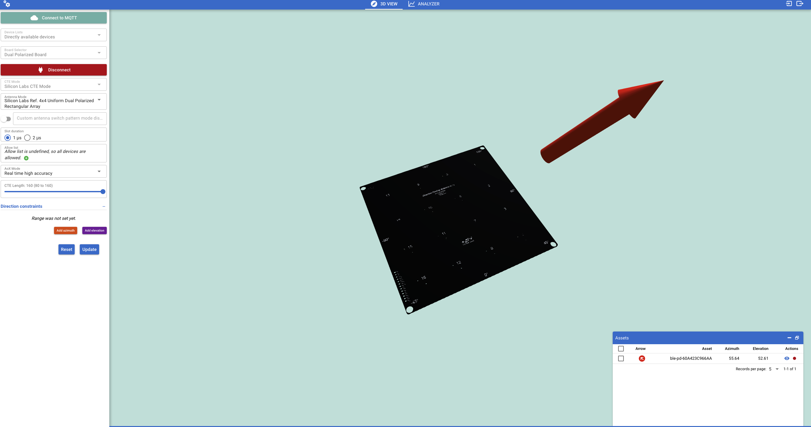
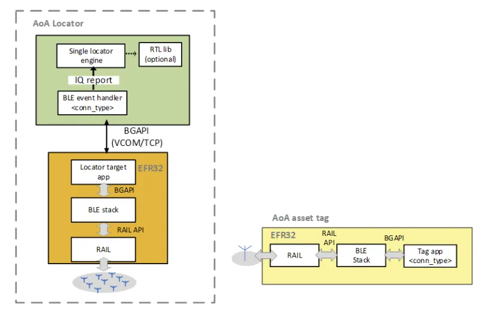
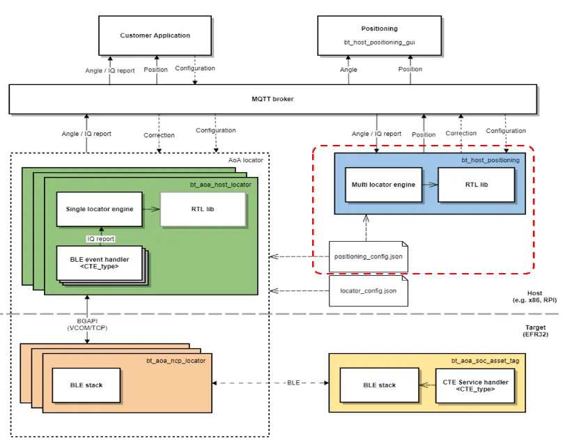
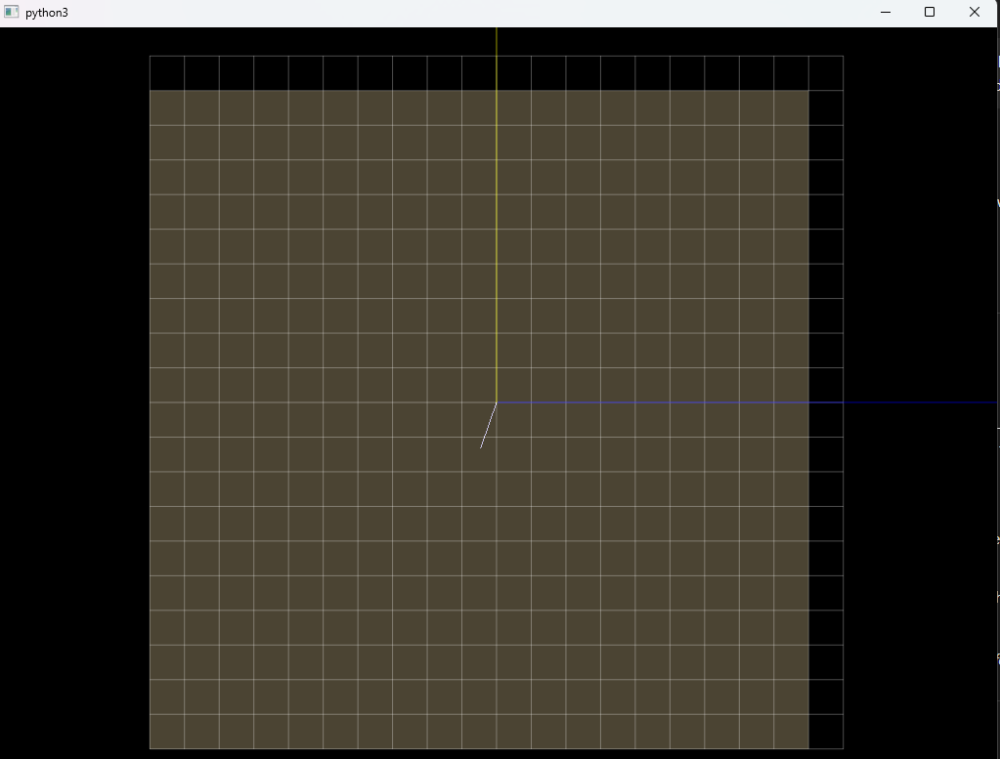
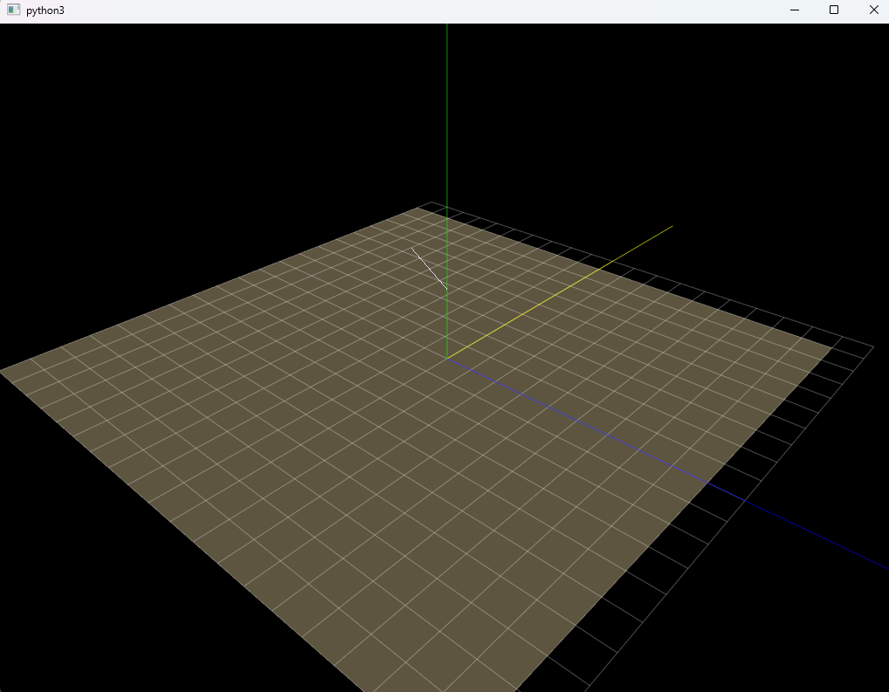

# ble-aoa-direction-finding


Exploring Bluetooth 5.1 direction finding using Silicon Labs hardware and the RTL (Real-Time Locating) library.

## Current Project Status

- [x] Hardware is fully functional (BRD4191A locator + BG22 tag).
- [x] AoA Analyzer successfully detects azimuth/elevation from the tag.
- [x] Python visualizer (`app.py`) runs and connects to MQTT.
- [x] (bt_aoa_host_locator, bt_host_positioning) work/available
- [x] Temporary config files were created manually to test the visualizer.
- [x] Angle/position data appears

## Mosquitto + Reminder

Mosquitto is required to run things outside of SimplicityStudio. Make sure this runs before starting the Python file.

## **Motivation**

Indoor positioning remains an open challenge for navigation, asset tracking, and smart environments. While GPS has transformed outdoor localization, it does not work indoors due to multipath and signal attenuation. Bluetooth 5.1 introduced **Direction Finding**, enabling receivers with antenna arrays to estimate **Angle of Arrival (AoA)** and thus localize BLE tags. In this project, we move beyond simulations to **build a real Bluetooth indoor localization platform** using commercial development boards, antenna arrays, and Silicon Labs’ RTL library. This hands-on system will let us stream real-time angle and position estimates, evaluate localization accuracy, and gain experience with both wireless signal processing and end-to-end IoT system design.

## **Background (what we’ll build on)**

Silicon Labs’ SDK ships a complete reference stack to accelerate DF development: **AoA asset-tag** (CTE transmitter), **AoA locator** (CTE receiver in NCP mode), a **host locator app** that runs the **RTL library** to compute angles, and a **positioning host app** that fuses angles from multiple locators via MQTT into (x,y,z) positions. The app note also documents the software architecture, sample projects, and tools (AoA Analyzer, Positioning Tool).

## Related Documentation:

- [Course Homepage](https://anplus.notion.site/2025-cs4900-6900)
- [Quick Start Guide](https://www.silabs.com/documents/public/quick-start-guides/qsg175-direction-finding-solution-quick-start-guide.pdf)
- [Development Guide](https://www.silabs.com/documents/public/application-notes/an1296-application-development-with-rtl-library.pdf)
- [Antenna Board BRD4191A Hardware Guide](https://www.silabs.com/documents/public/user-guides/ug531-brd4191a-user-guide.pdf)

## **What you will build (system design)**

**Inputs:**

- IQ samples from CTE packets at each locator + locator configuration (antenna type, switching pattern, masks), and the deployment topology (locator IDs, **coordinates**, **orientations**).

**Output:**

- Continuous **(x, y, z)** position estimates for each BLE tag (plus per-locator azimuth/elevation and uncertainty), published as JSON over **MQTT**.
  > Hardware Architecture
  > 
  > Software Architecture
  > 

## Software Architecture

Pipeline (end-to-end):

1. BLE **asset tag** transmits CTE (connection, connectionless, or Silabs Enhanced).
2. One or more **AoA locators** capture IQ, switch antennas per pattern, stream IQ to the host over USB.
3. **Host locator app** runs RTL to produce **angles** and publishes to MQTT topics.
4. **Positioning host** subscribes to angles from multiple locators, fuses them, and publishes tag **positions** to MQTT for visualization/apps.

---

## Bill Materials

- 1× **Tag**: EFR32xG22/G24 dev board (e.g., Thunderboard BG22), **BRD4184A with CR2032 battery**
- **Locators**: ~~at least **2** antenna array boards (recommended **4** for robust 2D/3D), each on a WSTK + EFR32xG22 running NCP locator FW.~~ We sticking with 1 :D
- **Antenna array**: Silicon Labs **BRD4191A 4×4 dual-polarized** URA (per locator).
- **PC/Host**: Windows (MSYS2/MinGW-64) or Linux (Ubuntu) box to run host apps, MQTT broker, and optional Python viz.
- Stands/ceiling mounts, tape measure, power, USB cables.

---

## Software You’ll Need

- **Simplicity Studio 5** – main IDE and tooling for Silicon Labs hardware  
  👉 Download: https://www.silabs.com/software-and-tools/simplicity-studio/simplicity-studio-version-5

- **Gecko SDK** – I downloaded this separately and added it into Simplecity Studio via after unzipping.  
  👉 Releases: https://github.com/SiliconLabs/gecko_sdk/releases  
  _(Use the latest release and grab it from the **Assets** section.)_

- **Bluetooth SDK ≥ v3.1** – installs automatically via Simplicity Studio’s Package Manager (used for the AoA sample projects).

- **RTL Library + Direction Finding Tool Suite (UG514)** – included as part of the Gecko/BT SDK packages in Simplicity Studio (used by the AoA Locator Host and Positioning Host apps).

- **MQTT stack**

  - **Mosquitto** MQTT broker – used as the message bus between the host apps and visualizer  
    👉 https://mosquitto.org/download
  - (Optional) **MQTT Explorer** – nice GUI to inspect MQTT topics  
    👉 https://mqtt-explorer.com

- **Build toolchain for the AoA Host apps**

  - **Windows:** `MSYS2`/`MinGW-w64` (for `make`, `gcc`, etc.)
  - **Linux:** standard `build-essential` + `libmosquitto-dev` (or distro equivalent)

- **Python 3.x** for the visualizer GUI (tested with Python 3.7+)
  - Install from https://www.python.org/ or your OS package manager
  - Python packages (via `pip`):
    ```bash
    pip install pyqtgraph pyqt5==5.14.0 pyopengl numpy Pillow paho-mqtt
    ```

## What I ended up doing:

To preface, I used Windows since MacOS was being weird.
So I built the python program using this command:

```bash
python3 app.py -c .\pos_config.json
```

At this moment, the python3 GUI graph was open but there was no data from the transmitter yet. (The graph was static with no change on movement of the transmitter). This is what using the SDK is for.

Then I compiled the aoa_host_locator using C's `make export` then I went into the `/export` folder, all the way to the new executable:

```bash
C:\Users\Ryan\Downloads\gecko-sdk\app\bluetooth\example_host\bt_aoa_host_locator\export\app\bluetooth\example_host\bt_aoa_host_locator
```

> Make sure to run the executible when it is in your present working directory since it will need to communicate with files inside the Gecko SDK, I ran into issues when moving it out of that directory.

Below is the command I ran for the bluetooth transmission signal to be picked up by the python graph

```bash
bt_aoa_host_locator.exe -u COM6 -b 115200 -m localhost:1883 -c config/locator_config.json -l debug
```

After running this, this is what the CLI returns:

```Subscribing to topic 'silabs/aoa/correction/ble-pd-0C4314F0325A/+'.
Subscribing to topic 'silabs/aoa/config/ble-pd-0C4314F0325A'.
New tag added (1): 60:A4:23:C9:66:AA
```

> You can Ctrl+C to exit this, but it will stop the receiving of the BTE transmission.
>  > 

---

## Experiment 1: BLE Interference & Localization Stability (With Calibration)

**Goal:**  
Evaluate how **BLE channel congestion** affects both the **accuracy** and the **stability** of Silicon Labs’ AoA-based indoor localization by measuring error at fixed, known positions.

---

### Calibration Setup (Before Interference Testing)

Define **3–5 calibration points** in your room with measured distances and angles relative to the locator.

Example calibration points:

- Point A: 1.0 m directly in front of antenna
- Point B: 1.5 m at +30° right
- Point C: 2.0 m at −45° left
- Point D: 2.5 m straight ahead near doorway

For each calibration point:

1. Measure the **exact physical distance** to the locator.
2. Record the **bearing** (azimuth direction).
3. Place the tag on a tripod or stable surface.

This produces your **ground truth dataset**.

---

### Interference Conditions

1. **Baseline (no interference):**

   - Raspberry Pi OFF
   - Collect 20–30 seconds of data at each calibration point.

2. **BLE Interference ON:**
   - Raspberry Pi 5 running a heavy BLE advertiser script (`btmgmt` continuous advertising)
   - Collect the same duration of data at each point.

---

### Data Collection

Collect the positioning data from MQTT for each calibration point and condition:

```bash
mosquitto_sub -h localhost -t "silabs/aoa/position/#" -v > position_pointA_baseline.txt
```

Then:

```bash
mosquitto_sub -h localhost -t "silabs/aoa/position/#" -v > position_pointA_interference.txt
```

Repeat for Points B, C, D, etc.

---

### Analysis Plan

For each calibration point:

1. **Accuracy (mean error)**

   - Compute mean (x, y)
   - Compare to ground-truth using Euclidean distance.

2. **Precision (stability)**

   - Compute variance and standard deviation of x and y.

3. **Angle behavior**

   - Compare azimuth and elevation spread under baseline vs interference.

4. **Visualizations**

   - Scatter plot of (x, y) position cloud
   - Mean error bar chart across conditions
   - Variance boxplot
   - Optional time-series x(t), y(t)

---

### What This Experiment Shows

- How BLE congestion impacts AoA localization accuracy
- Whether position estimates drift, jump, or destabilize
- Which angles/directions are most susceptible to interference
- How resilient Silicon Labs’ AoA solution is in a real indoor environment

## Experiment 2: Human Movement, Obstruction, and Doorway Effects

**Goal:**
Determine how **human body placement**, **doorway obstruction**, and **BLE interference** affect the ability of the AoA system to track movement accurately.

**Setup:**

- Define a path where the user walks **straight through a doorway** toward/away from the locator.
- Tag in two placements:

  - **Hand-held**
  - **In pocket**

- Optional: Include interference condition from Experiment 1.

**Conditions:**
Without interference:

1. Control walk (no tag — verify no false positives)
2. Tag in pocket
3. Tag in hand

With BLE interference (optional): 4. Tag in pocket + interference 5. Tag in hand + interference

**Procedure:**
For each recorded walk:

- 0–10s: Stand still
- 10–20s: Walk through the doorway at normal pace
- 20–30s: Stand still on opposite side
- Log via:

  ```bash
  mosquitto_sub -h localhost -t "silabs/aoa/position/#" -v > walk_conditionX.txt
  ```

**Analysis:**

- Plot _x(t)_, _y(t)_, and trajectories (x vs y).
- Compare:

  - Pocket vs hand: body-blocking effects
  - With vs without interference: increased noise or drift
  - Doorway transition detection clarity

- Discuss multipath, human absorption, distance estimation challenges, and tracking latency.

---
